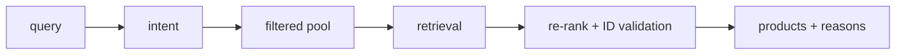
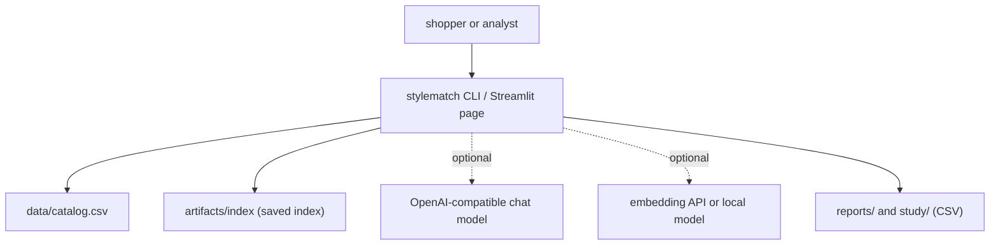
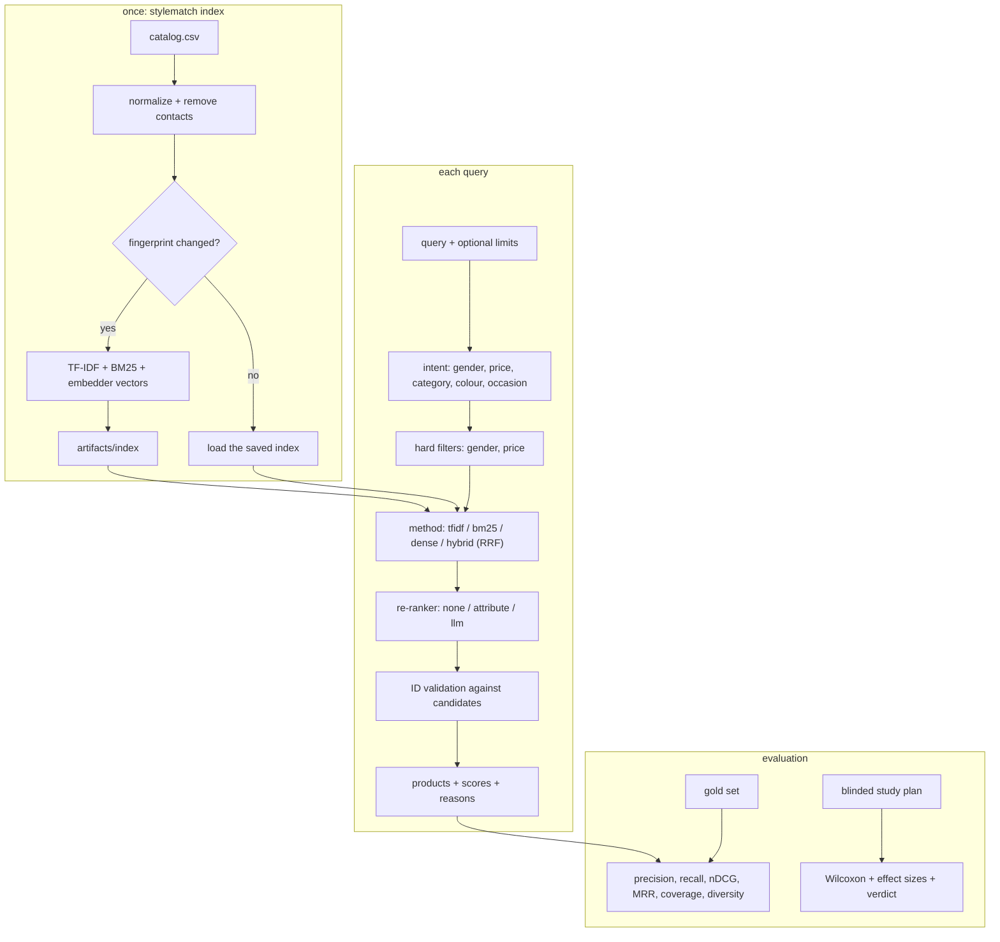

<div align="center">

# stylematch — Hybrid Fashion Recommender With Honest Evaluation

**stylematch is a fashion product recommender for shoppers and for teams that compare retrieval methods. It takes a free-text query through these steps to a ranked list of real catalog products with reasons:**

`parse the intent` → `filter the pool` → `retrieve (TF-IDF, BM25, dense, hybrid)` → `re-rank and validate IDs` → `give reasons` → `evaluate on labelled queries`.


-412991?style=flat-square&logo=openai&logoColor=white)


**[Summary](#1-summary)** ·
**[Workflow](#4-the-end-to-end-workflow)** ·
**[Run it](#10-how-to-run-stylematch)** ·
**[Configuration](#104-environment-variables)** ·
**[Known problems](#13-known-problems)** ·
**[Glossary](#15-glossary)**

</div>

> [!NOTE]
> This README uses ASD-STE100 Simplified Technical English. The writing rules and the project
> vocabulary are in [`docs/ste-style-guide.md`](docs/ste-style-guide.md). Each term in the
> [Glossary](#15-glossary) has only one meaning.

---

stylematch compares a TF-IDF baseline with BM25, dense and hybrid retrieval on one fashion catalog, under the same filters. An optional chat model can re-rank the retrieved products and give reasons. The chat model cannot add a product: each product ID that it returns must be a candidate. A labelled query set and a blinded user study decide which system is better. No chart shows a random or invented rating.

This README is the **one location that explains all of stylematch**. It gives these topics:

- the general design
- each component and its procedure, step by step
- the decision rules
- the data map
- the runbook
- the validation results and the known problems

| If you are… | Read |
|---|---|
| A manager or reviewer | [1](#1-summary), [3](#3-design-rules), [4](#4-the-end-to-end-workflow), [12](#12-validation-results), [14](#14-key-points) |
| A developer who joins the project | All sections, in sequence. Keep [10](#10-how-to-run-stylematch) and [13](#13-known-problems) open while you work |
| An operator who runs stylematch | [10](#10-how-to-run-stylematch), then the section for the component that you use |

---

## Table of contents

1. 🧭 [Summary](#1-summary)
2. 🏗️ [How stylematch is built](#2-how-stylematch-is-built)
   - 2.1 [Components](#21-components)
   - 2.2 [System context](#22-system-context)
   - 2.3 [Repository layout](#23-repository-layout)
3. 🛡️ [Design rules](#3-design-rules)
4. 🔄 [The end-to-end workflow](#4-the-end-to-end-workflow)
   - 4.1 [Full flow](#41-full-flow)
   - 4.2 [The life cycle of one query](#42-the-life-cycle-of-one-query)
5. 🔵 [Catalog, intent and index](#5-catalog-intent-and-index)
6. 🟢 [Retrieval and re-ranking](#6-retrieval-and-re-ranking)
7. 🟣 [Offline evaluation and the user study](#7-offline-evaluation-and-the-user-study)
8. ⚖️ [Decision rules and the safety model](#8-decision-rules-and-the-safety-model)
9. 🗂️ [Data and file map](#9-data-and-file-map)
10. ▶️ [How to run stylematch](#10-how-to-run-stylematch)
    - 10.1 [Prerequisites](#101-prerequisites) · 10.2 [Installation](#102-installation) · 10.3 [Run stylematch](#103-run-stylematch) · 10.4 [Environment variables](#104-environment-variables)
11. 🧩 [How to extend stylematch](#11-how-to-extend-stylematch)
12. ✅ [Validation results](#12-validation-results)
13. ⚠️ [Known problems](#13-known-problems)
14. 📌 [Key points](#14-key-points)
15. 📖 [Glossary](#15-glossary)
16. 📄 [License](#16-license)

---

## 1. Summary

**The problem.** A comparison of a chat-model recommender with a TF-IDF recommender needs the same products and real labels for both. These are the difficult questions:

- Do both systems see the same pool of products, after the same gender and price filters?
- Can the chat model recommend a product that is not in the catalog?
- Which relevance labels does the evaluation use, and who made them?
- How does a user study keep participants blind to the system, and who decides the verdict?
- How does the system answer a query such as "an outfit for a birthday party" that shares few words with the product text?

stylematch gives each of these questions its own component. The comparison uses one candidate pool, one gold set and one study protocol.

| Item | Value |
|---|---|
| Input | A catalog CSV, a free-text query, optional gender and price limits |
| Output | Ranked products from the catalog with retrieval scores and reasons, evaluation tables, a study verdict |
| Components | **8**: catalog loader, intent parser, index, retrievers, re-rankers, recommender, evaluation, user study |
| Providers | Optional: an OpenAI-compatible chat model (`llm` re-ranker), OpenAI-compatible embeddings, a local sentence-transformers model |
| Offline mode | Everything except the `llm` re-ranker. The default embedder (`lsa`) needs no key and no network |
| Safety | Each recommended product ID must be a retrieved candidate. The API key comes from the environment only |
| Tests | **55** unit tests (`pytest`). In CI, 54 pass and 1 skips (the Streamlit test needs the `ui` extra) |



---

## 2. How stylematch is built

### 2.1 Components

| Component | Module | Purpose |
|---|---|---|
| Settings | `src/stylematch/config.py` | Read the environment variables. Hide the API key in `repr` |
| Catalog loader | `src/stylematch/catalog.py` | Column contract, normalization, category, price band, contact removal |
| Tokenizer | `src/stylematch/text.py` | Tokens with stopword removal and plural folding |
| Intent parser | `src/stylematch/intent.py` | Gender, price range, categories, colours, occasions, expansion terms |
| Embedders | `src/stylematch/embed.py` | `lsa` (offline), `openai`, `sentence-transformers` |
| Index | `src/stylematch/index.py` | TF-IDF, BM25 and dense vectors, saved once with a fingerprint |
| Retrievers | `src/stylematch/retrieve.py` | Hard filters, `tfidf`, `bm25`, `dense`, `hybrid` (RRF) |
| Chat model adapters | `src/stylematch/llm.py` | OpenAI-compatible client (standard library HTTP), scripted client |
| Re-rankers | `src/stylematch/rerank.py` | `none`, `attribute`, `llm` with ID validation |
| Recommender | `src/stylematch/recommender.py` | Intent, retrieval, re-rank, reasons |
| Evaluation | `src/stylematch/evaluate.py` | Gold set, precision@k, recall@k, nDCG@k, MRR, coverage, diversity, labelling pool |
| User study | `src/stylematch/study.py` | Blinded plan, unblinding, Wilcoxon test, effect sizes, verdict |
| Synthetic data | `src/stylematch/synthetic.py` | Catalog with known attributes and a graded gold set |
| CLI | `src/stylematch/cli.py` | The `stylematch` command |
| UI (optional) | `src/stylematch/app/streamlit_app.py` | Two systems side by side, with scores and reasons |

### 2.2 System context



### 2.3 Repository layout

```
stylematch/
├── src/stylematch/
│   ├── config.py, text.py       # settings, tokenizer
│   ├── catalog.py, intent.py    # catalog contract, query intent
│   ├── embed.py, index.py       # embedders, saved index
│   ├── retrieve.py, rerank.py   # retrieval methods, re-rankers with ID validation
│   ├── llm.py, recommender.py   # chat model adapters, recommender facade
│   ├── evaluate.py, study.py    # offline metrics, user study
│   ├── synthetic.py, cli.py     # synthetic data, stylematch command
│   └── app/streamlit_app.py     # optional UI
├── tests/                       # 55 pytest tests, synthetic data only
├── data/README.md               # sources, licenses, expected columns
├── docs/ste-style-guide.md      # writing rules and project vocabulary
├── .github/workflows/ci.yml     # pytest on Python 3.11
├── pyproject.toml               # package, extras, console script
└── .env.example                 # variable names only
```

---

## 3. Design rules

### 3.1 The chat model only orders retrieved products
`rerank.validate_ranking` keeps only the IDs of retrieved candidates, once each. It appends the candidates that the chat model left out. `recommender.py` checks each ID against the index again before it shows a product.

### 3.2 One pool for every method
`retrieve.filter_rows` applies the gender and price filters before any method runs. The `tfidf` baseline, `bm25`, `dense` and `hybrid` get the same pool and the same search text.

### 3.3 The index is built once
`index.build_or_load` saves the index with a fingerprint. If the catalog and the embedder do not change, the next run loads the index. A query embeds only the query text.

### 3.4 Labels come from people or from known attributes
`evaluate.py` uses grades from the gold set only. It never uses one system as the truth for another system. The synthetic gold set uses the known attributes of the synthetic products.

### 3.5 The data decides the study verdict
`study.analyze` calculates the verdict from the Wilcoxon test and the bootstrap interval. The sheet that participants see does not name the systems.

### 3.6 No invented numbers in the UI
The recommender returns the retrieval score and a reason for each product. No component makes a random rating.

### 3.7 Credentials only from the environment
`config.Settings` reads the key from `STYLEMATCH_LLM_API_KEY` or `OPENAI_API_KEY`. The key does not appear in `repr`, and a pickled embedder does not contain it.

### 3.8 A light core with one dependency set
The core needs NumPy, pandas, SciPy and scikit-learn. The chat model and the embedding API use the Python standard library for HTTP. Streamlit and sentence-transformers are optional extras.

---

## 4. The end-to-end workflow

### 4.1 Full flow



### 4.2 The life cycle of one query

1. Parse the query into an intent.
2. Apply the gender filter and the price filter to the catalog. The result is the pool.
3. Add the expansion terms of each occasion to the search text.
4. Score the pool with the method and keep the top 50 candidates.
5. Order the candidates again with the re-ranker.
6. Remove each ID that is not a candidate. Append the candidates that the re-ranker left out.
7. Return the top k products with the retrieval score and a reason.

---

## 5. Catalog, intent and index

**Purpose.** Load the catalog once, understand the query and keep a saved index.

| Input | Output |
|---|---|
| `catalog.csv`, a query | A normalized catalog, an intent, the index folder `artifacts/index` |

**Procedure**

1. `catalog.normalize` maps the headers, checks the required columns and converts the price.
2. It removes duplicate product IDs, e-mail addresses, phone numbers and helpline sentences.
3. It adds `category` from the product name and `price_band` from the price.
4. `intent.parse_query` finds the gender, the price range (`under`, `over`, `between`), the categories and the colours.
5. It finds occasions such as `party`, `wedding`, `office` or `gym` and adds their expansion terms.
6. `index.build_index` fits TF-IDF, BM25 and the embedder on the product texts. It saves all three with a manifest.

**Rules**

- A missing required column or a price that is not a number stops the load.
- An explicit `--gender`, `--min-price` or `--max-price` overrides the query text.
- A gender query keeps unisex products: `women` matches `women` and `unisex`.

| Query word | Expansion terms (part) |
|---|---|
| `party`, `birthday` | dress, party, sequinned, shimmer, festive, celebration |
| `wedding`, `festival` | saree, lehenga, sherwani, kurta, ethnic, festive |
| `office`, `work`, `interview` | shirt, trousers, formal, blazer, workwear |
| `gym`, `workout`, `running` | sports, training, trackpants, running, shoes |
| `winter`, `beach`, `travel`, `casual` | jacket, sweater, shorts, sandals, bag, tshirt, jeans |

---

## 6. Retrieval and re-ranking

**Purpose.** Find the best candidates in the pool and order them.

| Input | Output |
|---|---|
| The intent, the index | Up to 50 candidates, then the top k products with reasons |

**Procedure**

1. `tfidf` calculates the cosine similarity of TF-IDF vectors. It is the baseline.
2. `bm25` calculates Okapi BM25 with `k1 = 1.5` and `b = 0.75`.
3. `dense` calculates the cosine similarity of embedder vectors. The `lsa` embedder is TF-IDF plus truncated SVD with up to 128 dimensions.
4. `hybrid` fuses the BM25 list and the dense list with RRF: `score = sum 1 / (60 + rank)`.
5. The `attribute` re-ranker adds 1.0 for a category match, 0.5 for a colour match and 0.3 for an expansion term.
6. The `llm` re-ranker sends up to 20 candidates (ID, name, brand, gender, category, colour, price) to the chat model.
7. The chat model must reply with JSON: `{"ranking": [{"id": ..., "reason": ...}]}`.
8. If the reply is not valid JSON, the recommender keeps the retrieval order and adds a note.

**Rules**

- Lexical methods return only candidates with a score above 0.
- The chat model works at temperature 0 in JSON mode. The client retries on HTTP 429, 500, 502 and 503.
- A reason from the chat model is kept only for a validated ID, with a maximum of 300 characters.

| Method | Uses | Strength |
|---|---|---|
| `tfidf` | Word overlap, weighted | Exact product words |
| `bm25` | Word overlap with length normalization | Exact words, long descriptions |
| `dense` | Co-occurrence of words (LSA) or a neural embedder | Related words |
| `hybrid` | RRF of `bm25` and `dense` | Both |

---

## 7. Offline evaluation and the user study

**Purpose.** Compare the systems with labelled queries and with people.

| Input | Output |
|---|---|
| A gold set, a query list, study ratings | Metric tables, nDCG differences with intervals, a labelling sheet, a study sheet and key, a verdict |

**Procedure (offline evaluation)**

1. Run every system on every gold query with the same k.
2. Calculate precision@k, recall@k, nDCG@k with gains `2^grade - 1`, MRR and the hit rate.
3. Calculate the coverage (distinct products shown / catalog size) and the brand diversity of each list.
4. Calculate the nDCG difference of each system against `tfidf` with a paired bootstrap over queries.
5. To make real labels, run `stylematch pool`. It merges the top items of all systems and shuffles them.

**Procedure (user study)**

1. Run `stylematch study-plan`. Each participant gets every query once, in a random order.
2. For each query, a coin flip decides which system makes "List 1".
3. Give `sheet.csv` to the participants. Keep `key.csv` hidden.
4. Each participant rates each list from 1 to 10.
5. Run `stylematch study-analyze`. It joins the ratings with the key.
6. The analysis takes the mean difference of each participant, so each person counts once.
7. It gives the Wilcoxon signed-rank test, the paired t test, Cohen's dz, the rank-biserial correlation and a bootstrap interval.

**Rules**

- The sheet and the labelling pool do not name the systems.
- A rating outside 1 to 10 stops the analysis.
- The verdict says "preferred" only if the Wilcoxon p-value is below 0.05 and the bootstrap interval excludes 0.

| Systems in the evaluation | Method | Re-ranker | Filters |
|---|---|---|---|
| `tfidf_unfiltered` | `tfidf` | `none` | No (the prototype setting, for reference) |
| `tfidf` (baseline) | `tfidf` | `none` | Yes |
| `bm25` | `bm25` | `none` | Yes |
| `dense` | `dense` | `none` | Yes |
| `hybrid` | `hybrid` | `none` | Yes |
| `hybrid_attribute` | `hybrid` | `attribute` | Yes |
| `hybrid_llm` | `hybrid` | `llm` | Yes, only with a configured chat model |

---

## 8. Decision rules and the safety model

| Rule | Value | Code |
|---|---|---|
| Candidates per method | `STYLEMATCH_CANDIDATES`, default 50 | `retrieve.py` |
| Products shown | `STYLEMATCH_TOP_K`, default 5 | `recommender.py` |
| RRF constant | 60 | `retrieve.py` |
| BM25 parameters | `k1 = 1.5`, `b = 0.75` | `index.py` |
| LSA dimensions | Up to 128, at least 2 | `embed.py` |
| Attribute bonus | Category 1.0, colour 0.5, expansion term 0.3 | `rerank.py` |
| Candidates sent to the chat model | 20 | `rerank.py` |
| Gender match | `women` → women, unisex. `men` → men, unisex. `kids` → boys, girls, unisex kids | `intent.py` |
| Price bands | under 500, 500-999, 1000-2499, 2500-4999, 5000+ | `catalog.py` |
| Grades | 0 not relevant, 1 partial match, 2 full match | `evaluate.py` |
| Study scale | 1 to 10 | `study.py` |
| Study verdict | Wilcoxon p < 0.05 and the 95 % bootstrap interval excludes 0 | `study.py` |

| Threat | What the code does |
|---|---|
| The chat model invents a product | `validate_ranking` removes every ID that is not a candidate. The recommender checks the ID against the index |
| The chat model sees unrelated products | It gets only the top 20 retrieved candidates of the filtered pool |
| The key leaks | The key comes from the environment. `repr` and `pickle` do not contain it. `.env` is ignored by git |
| Contact data in product text | `scrub_contacts` removes e-mail addresses, phone numbers and helpline sentences before indexing |
| A biased study | Random list order per query, random query order per participant, a hidden key |

---

## 9. Data and file map

| Path | Committed? | Contents |
|---|---|---|
| `data/README.md` | Yes | Sources, licenses, expected columns |
| `data/catalog.csv` | No (git ignores it) | The catalog |
| `data/gold.jsonl`, `data/labels.csv` | No (git ignores it) | Labelled queries |
| `artifacts/index/` | No (git ignores it) | `manifest.json`, `products.csv`, `tfidf.joblib`, `tfidf_matrix.npz`, `bm25.json`, `bm25_counts.npz`, `vectors.npy`, `embedder.joblib` |
| `reports/` | No (git ignores it) | `per_query.csv`, `summary.csv`, `comparisons.csv`, `pool.csv`, demo output |
| `study/` | No (git ignores it) | `sheet.csv`, `key.csv`, ratings |
| `.env` | No (git ignores it) | Local settings and the API key |
| `.env.example` | Yes | Variable names only |

---

## 10. How to run stylematch

### 10.1 Prerequisites

| Need | For |
|---|---|
| Python 3.11+ | All components |
| An OpenAI-compatible API key | Only the `llm` re-ranker and the `openai` embedder |
| `streamlit` (extra `ui`) | The Streamlit page |
| `sentence-transformers` (extra `sentence-transformers`) | The local neural embedder |

### 10.2 Installation

```bash
git clone https://github.com/KrishnaAnnavaram/stylematch.git
cd stylematch
python -m venv .venv
. .venv/bin/activate            # Windows: .venv\Scripts\activate
pip install -e ".[dev]"
pip install -e ".[ui]"          # optional: Streamlit page
```

### 10.3 Run stylematch

Run the offline demo first. It uses synthetic data only.

```bash
stylematch demo --out reports/demo
```

Run each step on your own catalog (see [`data/README.md`](data/README.md)).

```bash
stylematch synth --out data                                     # synthetic catalog + gold set
stylematch index                                                # build once, reuse later
stylematch index --rebuild --embedder lsa
stylematch recommend "an outfit for a birthday party for women under 3000"
stylematch recommend "black jeans" --gender men --max-price 2000 --method bm25 --rerank none --json
stylematch evaluate --gold data/gold.jsonl --k 10 --out reports/eval
stylematch pool --queries data/queries.jsonl --depth 20 --out data/pool.csv
stylematch study-plan --queries data/queries.jsonl --participants 20 --a hybrid_attribute --b tfidf --out study
stylematch study-analyze --ratings study/ratings.csv --key study/key.csv --a hybrid_attribute --b tfidf
stylematch ui                                                   # needs the ui extra
pytest -q
```

To use a chat model, set the key in `.env` or in the shell. Then use `--rerank llm`:

```bash
export STYLEMATCH_LLM_API_KEY=...        # or OPENAI_API_KEY
stylematch recommend "office wear for women" --rerank llm
```

### 10.4 Environment variables

| Variable | Used by | Meaning |
|---|---|---|
| `STYLEMATCH_CATALOG` | index | Catalog path, default `data/catalog.csv` |
| `STYLEMATCH_INDEX_DIR` | index | Index folder, default `artifacts/index` |
| `STYLEMATCH_EMBEDDER` | index | `lsa` (default), `openai` or `sentence-transformers` |
| `STYLEMATCH_EMBED_MODEL` | embedder | Model name for `openai` or `sentence-transformers` |
| `STYLEMATCH_LLM_PROVIDER` | re-ranker | `none` or `openai`. Default: `openai` if a key exists, else `none` |
| `STYLEMATCH_LLM_BASE_URL` | re-ranker, embedder | Base URL, default `https://api.openai.com/v1` |
| `STYLEMATCH_LLM_MODEL` | re-ranker | Chat model name, default `gpt-4o-mini` |
| `STYLEMATCH_LLM_API_KEY` | re-ranker, embedder | API key. `OPENAI_API_KEY` also works |
| `STYLEMATCH_LLM_TIMEOUT_S` | re-ranker, embedder | HTTP timeout in seconds, default `30` |
| `STYLEMATCH_TOP_K` | recommender | Products shown, default `5` |
| `STYLEMATCH_CANDIDATES` | retrievers | Candidates per method, default `50` |
| `STYLEMATCH_SEED` | LSA, pool, study | Random seed, default `42` |

Credentials are only in a local `.env` file or in the shell. Git ignores `.env`. Do not print or commit credentials.

---

## 11. How to extend stylematch

| You want to… | Do this | Code change? |
|---|---|---|
| Use a new catalog | Map its headers to the names in `catalog.COLUMNS` | No / Small |
| Add an occasion | Add a row to `OCCASIONS` in `intent.py` | Small |
| Add a category | Add a keyword to `CATEGORY_KEYWORDS` in `catalog.py` | Small |
| Use a neural embedder | `STYLEMATCH_EMBEDDER=sentence-transformers` and the extra | No |
| Add a re-ranker (for example a cross-encoder) | Subclass `Reranker` and add it to `make_reranker` | Small |
| Add a system to the comparison | Add it to `default_systems` in `evaluate.py` | Small |
| Serve an HTTP API | Wrap `Recommender.recommend` in a web framework | Yes |

---

## 12. Validation results

All results below come from `pytest` and from `stylematch demo` with seed `42`. The demo results use **synthetic data**: 1,500 products and 40 labelled queries. They are not results on the real catalog.

| Validation | Result | Command |
|---|---|---|
| Unit tests | **55 passed** with the `ui` extra. In CI: 54 passed, 1 skipped because the `ui` extra is not installed | `pytest -q` |
| nDCG@10 (synthetic) | `tfidf_unfiltered` 0.625, `tfidf` 0.890, `bm25` 0.911, `dense` 0.922, `hybrid` 0.924, `hybrid_attribute` 0.992 | `stylematch demo` |
| Precision@10 (synthetic) | `tfidf_unfiltered` 0.642, `tfidf` 0.918, `hybrid` 0.945, `hybrid_attribute` 0.945 | `stylematch demo` |
| nDCG@10 difference against `tfidf` (synthetic, 95 % interval) | `hybrid_attribute` +0.102 (0.049 to 0.166), `hybrid` +0.034 (0.000 to 0.082), `tfidf_unfiltered` -0.265 (-0.360 to -0.178) | `stylematch demo` |
| nDCG@10 for occasion queries (synthetic) | `tfidf` 0.883, `bm25` 0.952, `dense` 1.000, `hybrid` 0.995 | `stylematch demo` |
| Simulated study (SYNTHETIC ratings, 24 participants × 10 queries) | Verdict "participants preferred hybrid_attribute", Wilcoxon p = 7.9e-05, mean difference +0.90 | `stylematch demo` |

The tests show that each fix works. The filters alone raise the nDCG@10 of TF-IDF from 0.625 to 0.890 on the synthetic catalog. Dense and hybrid retrieval help most on occasion queries. The simulated study uses ratings that the demo generates, so it only proves that the analysis code works. The prototype reported a user preference for its chat-model recommender. That result is not reproduced here, because its ratings had no documented protocol.

---

## 13. Known problems

Read these problems before you use stylematch in production.

| # | Area | Problem | Impact and action |
|---|---|---|---|
| 1 | Validation | CI uses a synthetic catalog. No metric on the real catalog is reproduced here | Label real queries with `stylematch pool` and run `stylematch evaluate` |
| 2 | Synthetic data | The synthetic catalog is easier than real product text | Do not compare the synthetic numbers with numbers on real data |
| 3 | Intent | The parser is rule-based and English only. It knows a fixed list of occasions, colours and categories | Extend the maps in `intent.py` and `catalog.py` |
| 4 | Category | `infer_category` uses the first keyword in the product name. Some names give the wrong category | Check the `category` column after you load a new catalog |
| 5 | `llm` re-ranker | Not tested against a live API in CI. Reasons from the chat model are not fact-checked | Read the reasons. The product facts in the list come from the catalog |
| 6 | Dense retrieval | The default `lsa` embedder captures co-occurrence, not meaning | Use `sentence-transformers` or `openai` embeddings for real data |
| 7 | Study | The protocol needs real participants and consent. The demo ratings are simulated | Run `study-plan` with real people before you claim a preference |
| 8 | Scale | Exact vector search over all pool products | Use an approximate index for catalogs with millions of products |
| 9 | API | No HTTP API is included | Wrap `Recommender` in a web framework if you need one |

---

## 14. Key points

1. **The chat model cannot invent a product.** Each ID must be a retrieved candidate.
2. **Every method gets the same pool.** The gender and price filters run before retrieval.
3. **The index is built once.** A fingerprint decides when to build it again.
4. **Labels come from the gold set, not from another system.** nDCG uses graded gold labels.
5. **The data decides the study verdict.** The analysis counts each participant once.
6. **No random ratings.** The UI shows retrieval scores and reasons.
7. **The key stays in the environment.** It is not in the source, in `repr` or in a pickle.

---

## 15. Glossary

| Term | Meaning |
|---|---|
| **Baseline** | The `tfidf` system. All comparisons use it |
| **Candidate** | A product that a method returns from the pool, with a retrieval score |
| **Catalog** | The table of products that stylematch indexes |
| **Chat model** | The optional LLM behind the `llm` re-ranker |
| **Embedder** | The component that changes text into a vector |
| **Expansion terms** | The product words that the occasion map adds to the search text |
| **Fingerprint** | A SHA-256 value of the normalized catalog, the embedder and the index version |
| **Fusion** | Reciprocal-rank fusion (RRF) of the BM25 list and the dense list |
| **Gold set** | The labelled queries, with a grade for each relevant product |
| **Grade** | The relevance label of a product for a query: 0, 1 or 2 |
| **Hard filter** | A filter that removes products from the pool: gender and price |
| **Index** | The saved TF-IDF vectors, BM25 counts and dense vectors |
| **Intent** | The parsed form of a query |
| **Key** | The hidden study file that maps each list to its system |
| **Method** | A retrieval method: `tfidf`, `bm25`, `dense` or `hybrid` |
| **Occasion** | An event in a query, for example `party` or `wedding` |
| **Participant** | A person who rates lists in the study |
| **Pool** | The products that pass the hard filters for one query |
| **Rating** | A score from 1 to 10 that a participant gives a list in the study |
| **Re-ranker** | The component that orders the candidates again |
| **Reason** | The short text that tells why a product fits the query |
| **Retrieval score** | The score that the method gives a candidate |
| **Sheet** | The blind study file that participants fill |
| **Synthetic data** | The generated catalog and gold set. They are not real data |
| **System** | One method plus one re-ranker, for example `hybrid_attribute` |
| **Verdict** | The study result text that the analysis calculates from the tests |

---

## 16. License

[MIT](LICENSE) © 2026 Krishna Annavaram
